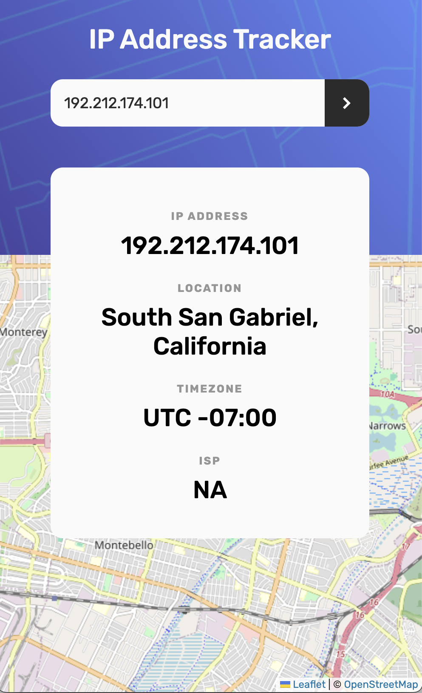

# Frontend Mentor - IP address tracker solution
This is a solution to the [IP address tracker challenge on Frontend Mentor](https://www.frontendmentor.io/challenges/ip-address-tracker-I8-0yYAH0). Frontend Mentor 

## Overview
A simple map application for searching by IP address using APIs. I found a challenge called the ‘IP Tracker App’ on Frontend Mentor. To obtain the IP address locations, I will be using the IP Geolocation API by IPify, and to generate the map, will use LeafletJS.

### The challenge
Users should be able to:
- View the optimal layout for each page depending on their device's screen size
- See hover states for all interactive elements on the page
- See their own IP address on the map on the initial page load
- Search for any IP addresses or domains and see the key information and location

### Screenshot

### Links
- Solution URL: [Add solution URL here](https://your-solution-url.com)
- Live Site URL: [Add live site URL here](https://ijkus.github.io/IP-tracker-v1/src/index.html)

## My process
- My Process Blog Post URL: [Noej dev-docs.](https://seokji.mycafe24.com/?p=191)
I am updating more options at the moment. Please feel free to leave a comment or suggest better solution idea!

### Built with
- Vanilla JavaScript
- HTML5
- CSS3

## Author
- Website(Blog) - [Noej Ijkus](https://seokji.mycafe24.com/)
- Frontend Mentor - [@ijkuS](https://www.frontendmentor.io/profile/ijkuS)# IP-tracker-v1
